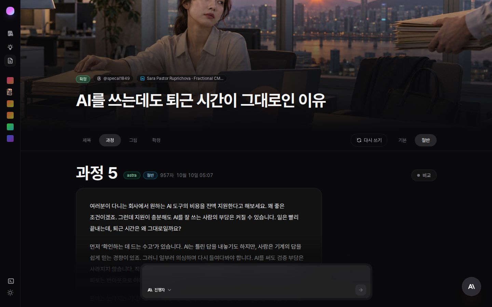
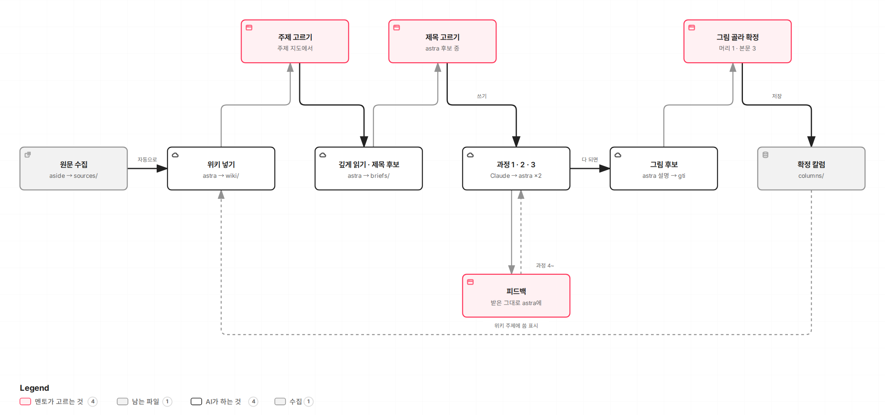
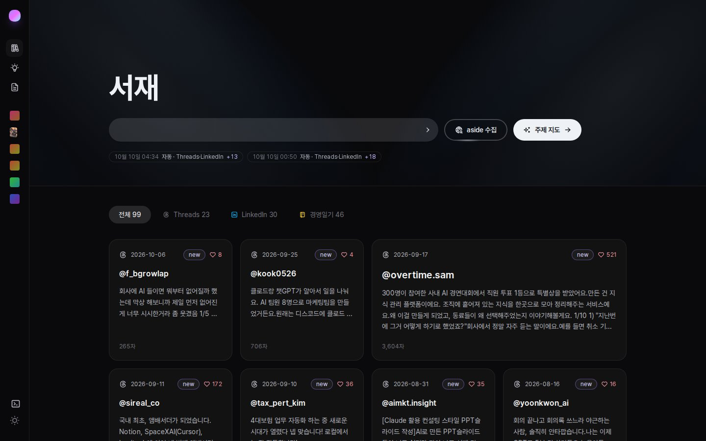
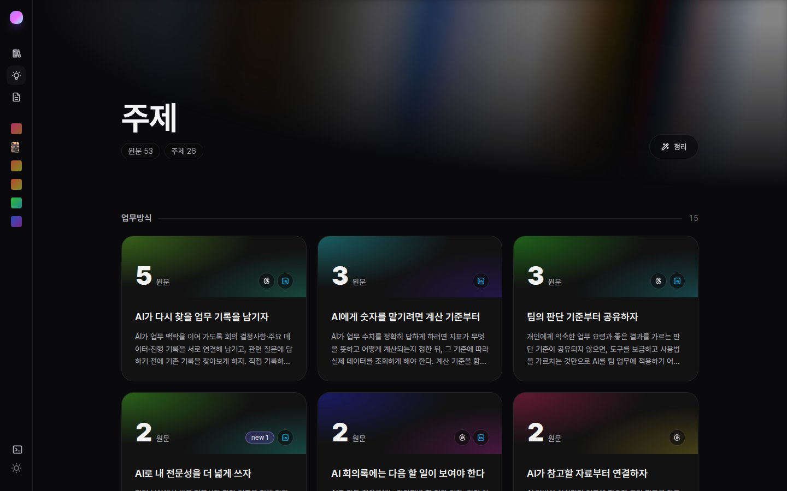
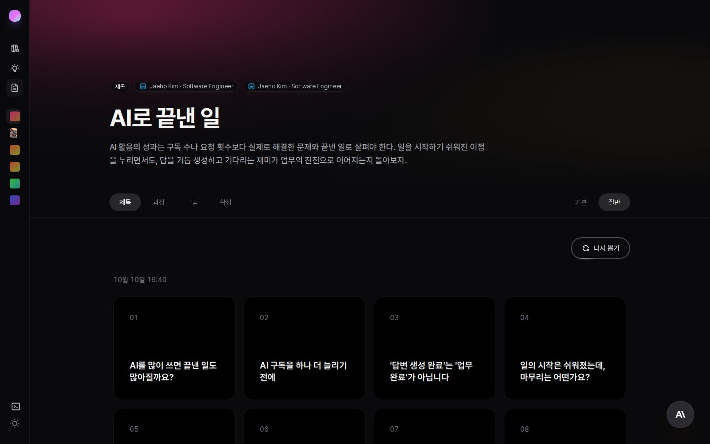
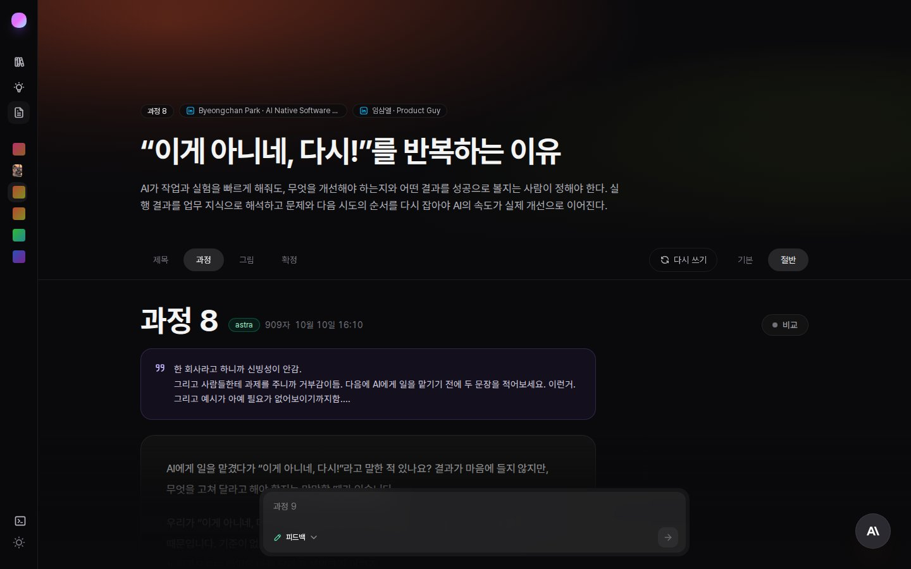
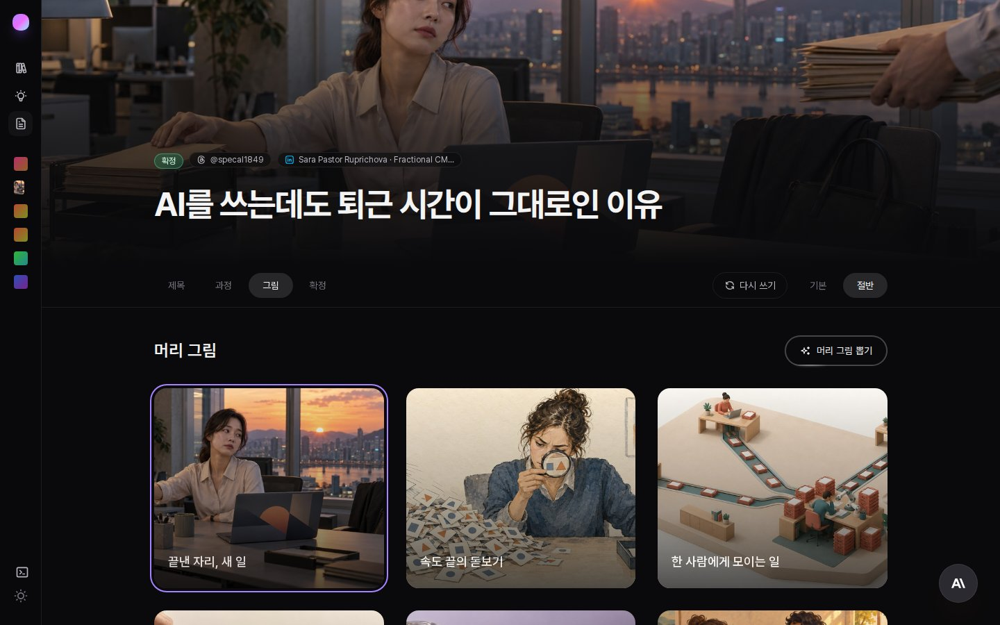
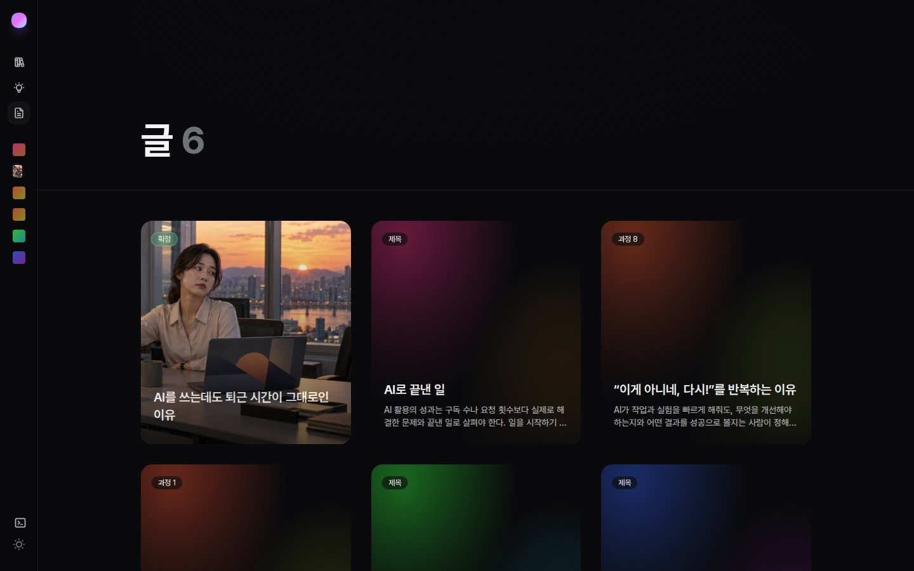
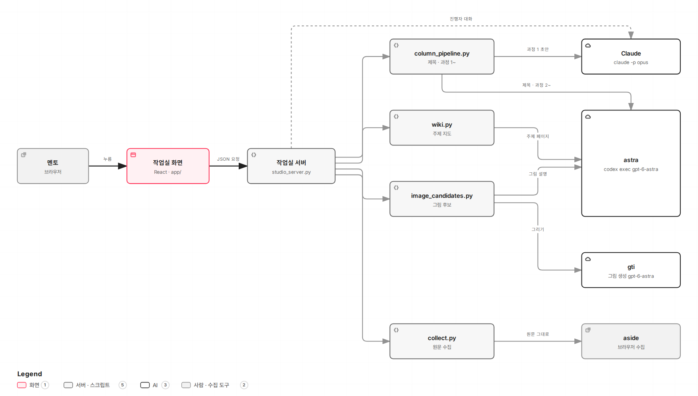

# 칼럼 작업실 (mentor-lab)

사내 뉴스레터에 실을 칼럼을 만드는 작업실입니다. 사람은 고르고 피드백하는 일만 하고,
원문 모으기·주제 정리·초안·고쳐 쓰기·그림은 AI가 맡습니다. 브라우저에서 버튼을 누르다 보면
원문 수집부터 확정까지 한 화면 안에서 칼럼 한 편이 나옵니다.

> 팀 저장소(`newsletter_upgrade`)의 아티클 파이프라인과는 따로, 멘토가 직접 쓰는 방식을 시험하려고 만든 저장소입니다.
> 팀 방식의 문체 지침·루브릭·증거 게이트는 쓰지 않습니다.


<sub>확정한 칼럼 「AI를 쓰는데도 퇴근 시간이 그대로인 이유」 — 머리 그림, 다섯 번째 과정을 거친 957자 본문</sub>

## 한눈에 보기



- **빨간 칸만 사람이 합니다.** 주제 고르기, 제목 고르기, 피드백, 그림 골라 확정까지 네 가지입니다.
- 나머지는 작업실이 합니다. 원문이 들어오면 위키에 저절로 정리되고, 주제를 고르면 제목 후보와 초안이 이어서 나옵니다.
- 피드백은 몇 번이든 보낼 수 있습니다. 보낼 때마다 과정 4, 5, …가 하나씩 쌓입니다.
- 확정한 칼럼은 위키 주제에 '씀'으로 표시되어, 주제 지도에서 이미 쓴 주제를 알아볼 수 있습니다.

## 화면으로 따라가기

### 1. 서재 — 원문 모으기



Threads·LinkedIn 글과 경영일기를 모아 두는 곳입니다. 입력창에 찾을 내용을 적고 **aside 수집**을 누르면
브라우저가 글을 찾아 원문 그대로 저장합니다(`sources/originals/`). 비워 두고 누르면 Threads·LinkedIn에서 알아서 찾아옵니다.

요약하지 않고 전체를 저장하는 게 원칙입니다. 요약본으로 글을 쓰면 원문의 맥락과 말맛이 빠지기 때문입니다.

### 2. 주제 지도 — 무엇을 쓸지 고르기



모은 원문은 위키(`wiki/`)로 정리됩니다. 논지 하나가 카드 하나입니다. 새 원문이 들어오면 비슷한 논지의 카드에 쌓이고,
새로운 논지면 카드가 새로 생깁니다. 카드의 큰 숫자는 그 주제를 뒷받침하는 원문 수입니다.

> **왜 위키인가** — 처음에는 원문 전체를 한꺼번에 AI에 넣고 주제를 뽑았는데, 뽑을 때마다 비슷한 주제가 되풀이됐습니다.
> 같은 원문 40편으로 세 방식을 블라인드 비교한 뒤 위키 방식을 골랐습니다. → [시험 기록](docs/2026-10-10-주제-위키-시험.md)

### 3. 제목 고르기



카드를 고르면 astra가 그 주제의 원문만 다시 깊게 읽어 글 설정(논지·참고 원문)을 다듬고, 제목 후보를 냅니다.
이 중 하나를 고릅니다. 마음에 드는 게 없으면 **다시 뽑기**를 누릅니다.
바라는 게 있으면 화면 아래 입력창(제목)에 적어 보내면 됩니다. 적은 말은 고치지 않고 그대로, 앞 회차 후보와 함께 astra에게 넘어가고,
회차마다 그때 보낸 말이 후보 위에 남습니다.

### 4. 과정과 피드백



제목을 정하고 **쓰기**를 누르면 세 과정이 차례로 돕니다.

| 과정 | 누가 | 하는 일 |
|---|---|---|
| 1 | Claude | 원문 전체와 경영일기 세 편의 문체를 참고해 초안을 씀 |
| 2 | astra | "경영일기 필자가 직접 썼다면" 하고 다시 씀 |
| 3 | astra | 지금까지 쌓인 멘토 기준(`briefs/standing-feedback.md`)을 반영 |

오른쪽 위에서 **절반**을 켜 두면 과정 3 다음에 분량을 절반으로 줄이는 과정이 하나 더 붙습니다.

그다음부터는 화면 아래 입력창에 피드백을 적어 보내면 됩니다. 적은 내용은 고치지 않고 그대로 astra에게 넘어가고,
결과는 다음 과정으로 쌓입니다. 위 화면은 피드백을 여러 번 주고받아 과정 8까지 온 글입니다.
지난 과정은 아래에 접혀 있어 언제든 다시 비교할 수 있습니다.

### 5. 그림 고르고 확정



astra가 글을 읽고 그림 설명을 쓰면 gti가 그립니다. 머리 그림 하나와 본문 그림 셋을 고릅니다.
본문 그림을 넣을 문단은 astra가 정합니다. **확정**을 누르면 칼럼이 `columns/`에 저장됩니다.

만든 글은 **글** 화면에 모입니다.



## 어떻게 돌아가나



화면의 버튼은 서버(`scripts/studio_server.py`)를 거쳐 스크립트 하나를 실행할 뿐입니다.
스크립트가 AI를 부르고, 단계와 단계 사이는 전부 파일로 이어집니다. 그래서 어느 단계든 파일을 열어 보면
무엇이 들어가고 무엇이 나왔는지 확인할 수 있습니다.

| 누가 | 맡은 일 |
|---|---|
| Claude (`claude -p --model opus`) | 과정 1 초안, 화면 오른쪽 아래 진행자(말로 작업을 부탁하는 창) |
| astra (`codex exec -m gpt-6-astra`) | 주제 위키, 제목 후보, 과정 2부터 끝까지, 그림 설명 |
| gti (gpt-6-astra) | 그림 |
| aside | 브라우저로 원문 수집 |

단계 사이를 잇는 파일:

```
sources/originals/   수집한 원문 (사이트별, 원문 그대로)
wiki/                주제 페이지 — 논지, 원문 목록, 쓸 수 있는 각도
briefs/<글>.json     글 설정 — 논지, 참고 원문, 제목, 분량
runs/                과정마다 들어간 것과 나온 것, 작업 로그
columns/<글>.md      확정 칼럼 (과정 기록은 <글>.process.json)
```

두 도식은 클릭해서 따라가 볼 수 있는 페이지로도 있습니다. 작업실 서버를 켠 뒤
http://localhost:8771/docs/2026-10-10-동작-원리.html 에서 여세요(GitHub에서는 열리지 않습니다).

## 만들 때 지킨 것

- **원문은 그대로** — 글은 언제나 원문 전체를 보고 씁니다. 위키와 요약은 목차 역할만 합니다.
- **피드백도 그대로** — 사람이 쓴 피드백을 AI가 해석해 바꾸지 않고 파일째 넘깁니다.
- **제목은 astra가** — Claude가 지은 제목은 상투적이라는 평가를 받아, 제목 후보는 astra만 냅니다.
- **원문 보호** — astra는 `wiki/` 안에서만 파일을 쓸 수 있습니다. 원문 폴더는 읽기만 됩니다.
- **옮기지 않고, 지어내지 않고** — 칼럼에 원문 문장을 그대로 옮기지 않고, 출처에 없는 수치·인용을 쓰지 않습니다.

## 실행하기

필요한 것: Python 3, Node.js, `claude`(Claude Code), `codex`(gpt-6-astra), gti(god-tibo-imagen), aside

```bash
cd app && npm install && npm run build            # 화면 빌드
cd .. && python3 -I scripts/studio_server.py 8771
# → http://localhost:8771  (데스크톱 브라우저)
```

- 서버는 이 컴퓨터(localhost)에서만 열립니다. Tailscale을 쓰면 그 주소에도 열려 내 다른 기기에서 접속할 수 있습니다.
- 화면 코드만 고쳤으면 `npm run build`만 다시 하면 됩니다. 서버 코드를 고쳤으면 진행 중인 작업이 없을 때 재시작하세요.
  재시작하면 진행 중인 작업의 후처리(수집 뒤 위키 넣기 등)가 끊깁니다.
- 수집은 `aside-win`(WSL) 또는 `aside`(Windows) 명령을 씁니다. 그림은 `~/.codex/skills/god-tibo-imagen`이 있으면 그것을,
  없으면 저장소 사본 `tools/god-tibo-imagen`을 씁니다.

### Windows에서 처음 설치

1. Git으로 저장소를 받습니다. Git이 없으면 PowerShell에서 `winget install Git.Git`부터 합니다.
   ```powershell
   git clone -b mentor-lab https://github.com/mynsoi/newsletter_upgrade.git mentor-lab
   ```
2. 받은 폴더의 **`setup-windows.cmd`를 더블클릭**합니다. Python·Node.js·Claude Code·codex·Pillow·화면 패키지를
   설치하고 화면까지 빌드합니다. 이미 있는 것은 건너뛰므로 여러 번 돌려도 됩니다.
3. 끝에 나오는 **남은 일**을 합니다. 계정이 필요한 일이라 스크립트가 대신하지 않습니다.
   Claude 로그인(`claude`), Codex 로그인(`codex login` — astra·그림이 씀),
   [Aside](https://aside.com/download) 설치·로그인, git 이름·메일.
4. **`start-windows.cmd`를 더블클릭**하면 작업실이 뜹니다 → http://localhost:8771

Windows에서 명령으로 돌릴 때는 `python3 -I` 대신 `py -3 -X utf8 -I`를 씁니다(`-X utf8`이 없으면 한글이 깨집니다).

화면 없이 명령으로도 돌릴 수 있습니다.

```bash
python3 -I scripts/collect.py "찾을 내용"                         # 원문 수집 (비우면 자동)
python3 -I scripts/wiki.py --ingest                               # 아직 안 넣은 원문을 위키에
python3 -I scripts/column_pipeline.py --titles briefs/<글>.json   # 제목 후보 (--message <메시지.txt>: astra에게 같이 보낼 말)
python3 -I scripts/column_pipeline.py briefs/<글>.json            # 과정 1·2·3
python3 -I scripts/column_pipeline.py --revise briefs/<글>.json <피드백.txt>
python3 -I scripts/image_candidates.py <글>                       # 머리 그림 후보 (--inline: 본문 그림)
```

## 더 보기

- [handoff.md](handoff.md) — 지금까지의 결정, 운영할 때 주의할 점, 남은 일 (이어받는 사람용)
- [criteria.md](criteria.md) — 초안을 읽고 나온 멘토 기준
- [docs/2026-10-10-주제-위키-시험.md](docs/2026-10-10-주제-위키-시험.md) — 주제를 위키로 쌓기로 한 근거
- [interview.md](interview.md) · [aside-collect.md](aside-collect.md) — 초기 인터뷰와 수집 지시문

<details>
<summary>화면 컴포넌트 출처</summary>

shadcn 레지스트리로 설치한 뒤 용도에 맞게 손질했습니다(`app/src/components/`).

| 화면 | 컴포넌트 | 출처 |
|---|---|---|
| 왼쪽 메뉴 | Sidebar | Aceternity UI (21st.dev manuarora700) |
| 서재 카드 | Bento Grid + Glowing Effect | Aceternity UI |
| 서재 수집 입력 | Placeholders and Vanish Input | Aceternity UI |
| 서재 머리 | Spotlight (new) | Aceternity UI |
| 사이트·화면 탭 | Tabs (알약 애니메이션) | Aceternity UI |
| 주제 카드 | Expandable Card (grid) | Aceternity UI |
| 주제 머리 | Aurora Background | Aceternity UI |
| 글 목록·그림 후보 | Focus Cards | Aceternity UI |
| 글 목록 머리 | Background Beams | Aceternity UI |
| 제목 후보 | Card Hover Effect | Aceternity UI |
| 과정 1·2·3… | Timeline | Aceternity UI |
| 쓰기 진행 | Multi Step Loader | Aceternity UI |
| 뽑기 버튼 | Hover Border Gradient | Aceternity UI |
| 피드백·진행자 입력 | AI Prompt | Kokonut UI (21st.dev kokonutd) |
| 작업 중 글자 | AI Text Loading | Kokonut UI |
| 쓰기·확정 버튼 | Particle Button | Kokonut UI |
| 원문·진행자 패널 | Drawer | shadcn/ui |
| 라이트/다크 전환 | ThemeToggle | BoardUI |

21st.dev 레지스트리(`https://21st.dev/r/...`)는 2026-10 기준 로그인(API 키)이 있어야 받을 수 있어서(403),
같은 컴포넌트를 원저자 공개 레지스트리(ui.aceternity.com/registry · kokonutui.com/r)에서 받았습니다.

</details>
